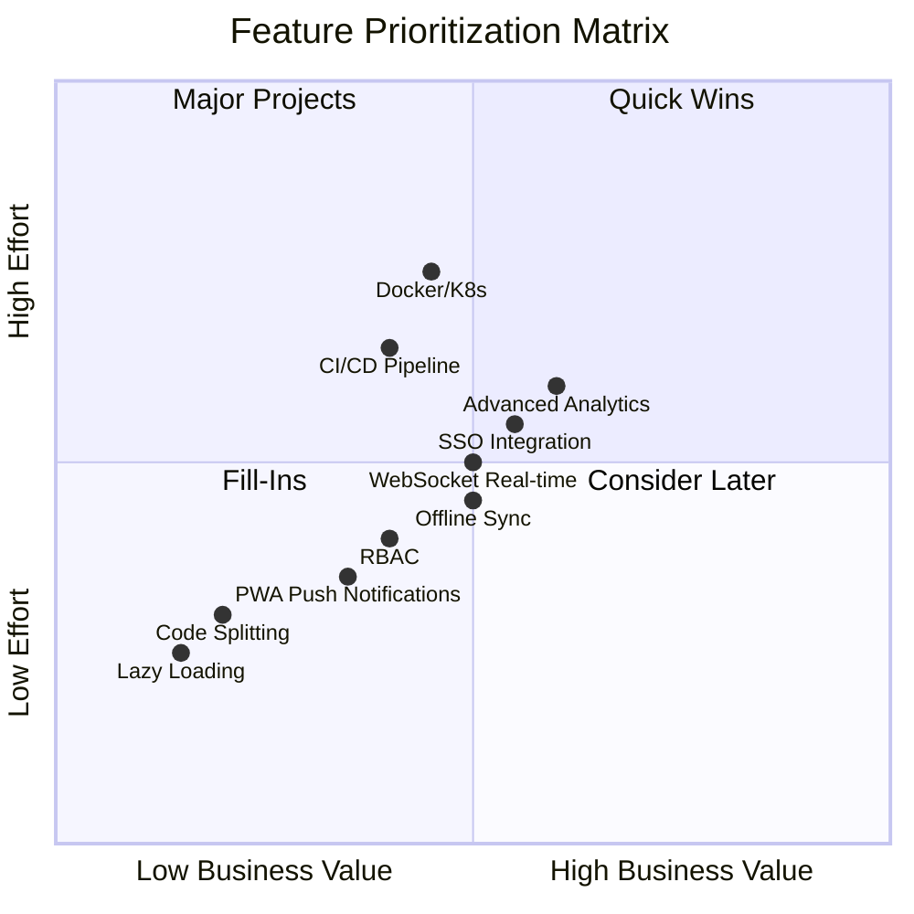
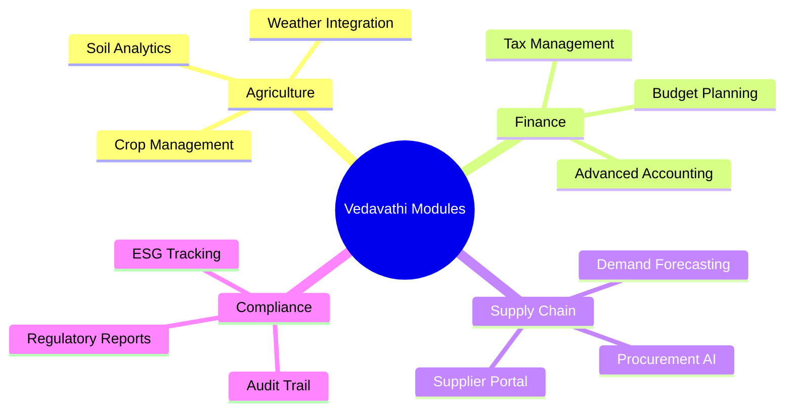
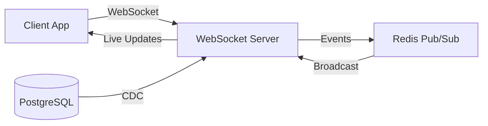
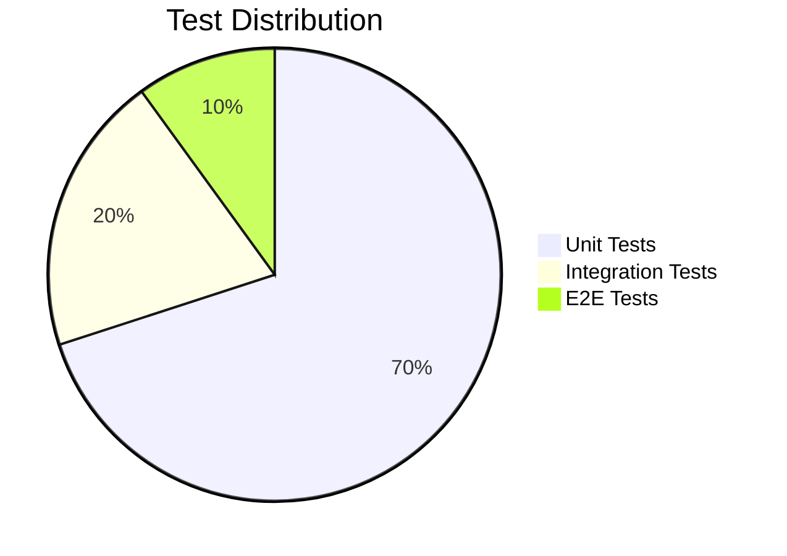

# Vedavathi Dashboard - Comprehensive Feature Enhancement Plan

> **Document Version:** 1.0  
> **Date:** March 2026  
> **System:** Enterprise ERP Dashboard (36+ Modules, ~1.1MB app.js)

---

## Executive Summary

This document outlines a strategic roadmap for enhancing the Vedavathi Operations Command Center into a world-class enterprise ERP system. The current architecture is a monolithic vanilla JavaScript SPA that requires modernization to support enterprise-scale operations, real-time collaboration, and advanced analytics.

### Current State Assessment

| Aspect | Current Status |
|--------|---------------|
| **Architecture** | Single-page app, vanilla JS, monolithic app.js (~1.1MB) |
| **Database** | PostgreSQL via InsForge/Supabase, 30+ tables |
| **Authentication** | Basic demo mode, no production auth |
| **Real-time** | None (polling-based updates only) |
| **PWA** | Basic service worker, cache-first strategy |
| **Testing** | None |
| **Deployment** | Manual (Node.js server.js) |
| **Responsive** | Basic CSS grid, limited mobile optimization |

---

## Priority Matrix



---

## 1. Performance Optimizations

### 1.1 Lazy Loading & Code Splitting

**Priority:** P0 - Critical  
**Business Value:** High  
**Effort:** Medium

#### Current Problem
- Monolithic 1.1MB app.js loads entirely on initial page load
- 36+ modules bundled together despite only 1-2 being visible at a time
- Poor Time to Interactive (TTI) on slow connections

#### Implementation Approach

```javascript
// BEFORE: Current monolithic structure (app.js)
const pages = { solar: `...`, wind: `...`, hydro: `...`, /* 30+ more */ };

// AFTER: Dynamic imports
const moduleRegistry = {
  'solar': () => import('./modules/solar.js'),
  'wind': () => import('./modules/wind.js'),
  'hydro': () => import('./modules/hydro.js'),
  // Lazy load remaining modules
};

async function loadPage(pageName) {
  const loader = moduleRegistry[pageName];
  if (!loader) return console.error(`Module ${pageName} not found`);
  
  // Show loading skeleton
  showPageLoader();
  
  // Dynamically import module
  const module = await loader();
  renderPage(module.default);
  
  // Track metrics
  performance.mark(`page-${pageName}-loaded`);
}
```

#### Implementation Steps

1. **Create module directory structure**
   ```
   dashboard/
   ├── modules/
   │   ├── energy/
   │   │   ├── solar.js
   │   │   ├── wind.js
   │   │   ├── hydro.js
   │ biogas.js
     │   ├── │   │   ├── hydrogen.js
   │   │   ├── kinetic.js
   │   │   └── grid.js
   │   ├── agriculture/
   │   │   ├── dairy.js
   │   │   ├── poultry.js
   │   │   ├── aqua.js
   │   │   └── ...
   │   └── ...
   ```

2. **Implement dynamic import router**
   - Create lazy-loader.js as entry point
   - Maintain backward compatibility during transition

3. **Add route-based code splitting**
   - Use import() for each module
   - Implement webpack-like bundling using native ES modules or Rollup

4. **Add loading skeletons and progress indicators**

#### Expected Impact
- Initial bundle size: 1.1MB → ~150KB (core + visible module)
- Estimated TTI improvement: 40-60% faster
- Memory footprint: Significant reduction

---

### 1.2 Image Optimization & Lazy Loading

**Priority:** P1 - High  
**Business Value:** High  
**Effort:** Low

#### Implementation

1. **Use native lazy loading**
   ```html
   
   ```

2. **Implement Intersection Observer for custom lazy loading**
   ```javascript
   const imageObserver = new IntersectionObserver((entries) => {
     entries.forEach(entry => {
       if (entry.isIntersecting) {
         const img = entry.target;
         img.src = img.dataset.src;
         img.classList.add('loaded');
         imageObserver.unobserve(img);
       }
     });
   });
   ```

3. **Use WebP/AVIF formats with fallbacks**
   ```html
   <picture>
     <source srcset="chart.avif" type="image/avif">
     <source srcset="chart.webp" type="image/webp">
     
   </picture>
   ```

4. **Implement responsive images with srcset**
   ```html
   
   ```

---

## 2. UI/UX Improvements

### 2.1 Responsive Design Patterns

**Priority:** P0 - Critical  
**Business Value:** High  
**Effort:** Medium

#### Current State
- Sidebar navigation collapses on mobile
- Basic CSS grid layout
- No tablet-specific optimizations

#### Target Breakpoints
- **Mobile:** 320px - 767px
- **Tablet:** 768px - 1023px
- **Desktop:** 1024px+

#### Implementation

```css
/* Mobile-first responsive utilities */
:root {
  --sidebar-width: 260px;
  --sidebar-collapsed: 60px;
  --header-height: 60px;
}

/* Tablet */
@media (min-width: 768px) and (max-width: 1023px) {
  :root {
    --sidebar-width: 200px;
  }
  .kpi-grid { grid-template-columns: repeat(2, 1fr); }
}

/* Desktop */
@media (min-width: 1024px) {
  .kpi-grid { grid-template-columns: repeat(4, 1fr); }
}

/* Mobile */
@media (max-width: 767px) {
  .app-layout { flex-direction: column; }
  .sidebar { 
    position: fixed; 
    transform: translateX(-100%);
    z-index: 1000;
  }
  .sidebar.open { transform: translateX(0); }
  .kpi-grid { grid-template-columns: 1fr; }
  .page-header { flex-direction: column; gap: 10px; }
  .header-actions { flex-wrap: wrap; }
}
```

#### Touch Optimization
- Minimum touch target: 44x44px
- Swipe gestures for sidebar toggle
- Pull-to-refresh on mobile

---

### 2.2 Accessibility (WCAG 2.1 AA)

**Priority:** P0 - Critical  
**Business Value:** High  
**Effort:** Medium

#### Current Gaps
- Some interactive elements lack proper ARIA labels
- Color contrast may not meet 4.5:1 ratio
- Keyboard navigation incomplete
- No screen reader announcements for dynamic content

#### Implementation Checklist

| Feature | Current | Target | Action |
|---------|---------|--------|--------|
| Color Contrast | Partial | 4.5:1 | Audit and update CSS variables |
| Keyboard Nav | Partial | Full | Add tabindex, focus styles |
| ARIA Labels | Partial | Complete | Add to all interactive elements |
| Screen Reader | None | Full | Add aria-live regions |
| Focus Management | None | Required | Focus trap modals |
| Skip Links | None | Required | Add skip-to-content links |

#### Code Examples

**Focus trap for modals:**
```javascript
function trapFocus(element) {
  const focusable = element.querySelectorAll(
    'button, [href], input, select, textarea, [tabindex]:not([tabindex="-1"])'
  );
  const firstFocusable = focusable[0];
  const lastFocusable = focusable[focusable.length - 1];

  element.addEventListener('keydown', (e) => {
    if (e.key === 'Tab') {
      if (e.shiftKey && document.activeElement === firstFocusable) {
        e.preventDefault();
        lastFocusable.focus();
      } else if (!e.shiftKey && document.activeElement === lastFocusable) {
        e.preventDefault();
        firstFocusable.focus();
      }
    }
  });
}
```

**Live region for dynamic updates:**
```html
<div aria-live="polite" aria-atomic="true" class="sr-only">
  <span id="announcer"></span>
</div>
```

---

### 2.3 Modern Component Library Recommendations

**Priority:** P1 - High  
**Business Value:** High  
**Effort:** High

#### Recommendation: Adopt Headless UI or Radix UI

| Library | Pros | Cons |
|---------|------|------|
| **Headless UI** | Lightweight, Tailwind-friendly, Vue/React support | Requires React/Vue |
| **Radix UI** | Accessible primitives, no styling | Requires React |
| **Vanilla JS Custom** | No dependencies, full control | More development time |

#### Migration Path (No Framework Change)

1. **Create component base classes**
   ```javascript
   class Modal {
     constructor(container, options = {}) {
       this.container = container;
       this.options = options;
       this.init();
     }
     
     init() {
       this.container.setAttribute('role', 'dialog');
       this.container.setAttribute('aria-modal', 'true');
       this.setupBackdrop();
       this.setupCloseEvents();
     }
   }
   ```

2. **Build reusable component library**
   - Modal, Dropdown, Accordion, Tabs, Toast, DataTable, Form

3. **Add CSS custom properties for theming**
   ```css
   :root {
     --color-primary: #00b0ff;
     --color-primary-hover: #0090e0;
     --color-surface: var(--bg2);
     --radius-md: 8px;
     --shadow-lg: 0 10px 25px rgba(0,0,0,0.15);
   }
   ```

---

## 3. Additional Module Suggestions

### 3.1 High-Value Business Modules



### 3.2 Industry-Specific Modules

| Module | Description | Priority |
|--------|-------------|----------|
| **Cold Chain** | Temperature monitoring for dairy/fisheries | P1 |
| **Weather Integration** | Hyperlocal weather API for farming decisions | P1 |
| **Equipment Fleet** | Tractor/farm equipment tracking & maintenance | P2 |
| **Laboratory** | Soil/water/feed testing management | P2 |
| **Contract Farming** | Farmer contracts & output tracking | P2 |
| **Export Documentation** | FSSAI, APEDA compliance for exports | P2 |

---

## 4. Real-time Collaboration

### 4.1 WebSocket Integration

**Priority:** P0 - Critical  
**Business Value:** High  
**Effort:** High

#### Architecture



#### Implementation Steps

1. **Set up WebSocket server**
   ```javascript
   // server/websocket.js
   const { Server } = require('ws');
   const wss = new Server({ port: 8081 });
   
   const clients = new Map();
   
   wss.on('connection', (ws, req) => {
     const userId = req.headers['x-user-id'];
     clients.set(userId, ws);
     
     ws.on('message', (message) => {
       const data = JSON.parse(message);
       handleMessage(userId, data);
     });
     
     ws.on('close', () => clients.delete(userId));
   });
   
   function broadcast(channel, message) {
     clients.forEach((ws) => {
       if (ws.readyState === WebSocket.OPEN) {
         ws.send(JSON.stringify({ channel, data: message }));
       }
     });
   }
   ```

2. **Add client-side WebSocket manager**
   ```javascript
   // js/realtime.js
   class RealtimeManager {
     constructor() {
       this.ws = null;
       this.listeners = new Map();
       this.reconnectAttempts = 0;
     }
     
     connect() {
       this.ws = new WebSocket(`wss://${window.location.host}/ws`);
       this.ws.onmessage = (e) => {
         const { channel, data } = JSON.parse(e.data);
         this.emit(channel, data);
       };
     }
     
     subscribe(channel, callback) {
       if (!this.listeners.has(channel)) {
         this.listeners.set(channel, []);
       }
       this.listeners.get(channel).push(callback);
     }
     
     emit(channel, data) {
       const callbacks = this.listeners.get(channel) || [];
       callbacks.forEach(cb => cb(data));
     }
   }
   
   window.realtime = new RealtimeManager();
   ```

3. **Subscribe to data changes**
   ```javascript
   // In modules that need real-time updates
   realtime.subscribe('cattle_milk', (data) => {
     updateMilkProductionWidget(data);
   });
   
   realtime.subscribe('energy_generation', (data) => {
     updateEnergyKPIs(data);
   });
   ```

---

### 4.2 Multi-user Editing

**Priority:** P1 - High  
**Business Value:** High  
**Effort:** Medium

#### Implementation

1. **Add presence indicators**
   ```javascript
   // Show who's viewing the same page
   realtime.subscribe('presence:page', ({ page, users }) => {
     renderPresenceAvatars(users); // e.g., "2 others viewing"
   });
   ```

2. **Implement optimistic locking**
   ```javascript
   async function updateRecord(table, id, changes) {
     const version = await getRecordVersion(table, id);
     
     try {
       await db.update(table, id, { ...changes, _version: version + 1 });
     } catch (conflict) {
       showConflictDialog(await getRecord(table, id), changes);
     }
   }
   ```

---

### 4.3 Presence Indicators

**Priority:** P2 - Medium  
**Business Value:** Medium  
**Effort:** Low

- Show active users in header
- Display "User is typing..." for forms
- Real-time cursor presence for collaborative editing

---

## 5. Advanced Analytics & Reporting

### 5.1 Interactive Charts Enhancements

**Priority:** P1 - High  
**Business Value:** High  
**Effort:** Medium

#### Current: Chart.js (basic)
#### Recommended: Apache ECharts or Plotly

| Feature | Chart.js | ECharts |
|---------|----------|---------|
| Large datasets | Limited | 100K+ points |
| 3D Charts | No | Yes |
| Map support | No | Yes |
| Themeable | Basic | Advanced |

#### Implementation

```javascript
// Replace Chart.js with ECharts
const chart = echarts.init(document.getElementById('energy-chart'));

const option = {
  theme: 'dark',
  tooltip: { trigger: 'axis' },
  legend: { data: ['Solar', 'Wind', 'Hydro'] },
  xAxis: { type: 'time', data: timeSeriesData },
  yAxis: { type: 'value', unit: 'MW' },
  dataZoom: [{ type: 'slider' }, { type: 'inside' }],
  series: [
    { name: 'Solar', type: 'line', data: solarData, smooth: true },
    { name: 'Wind', type: 'line', data: windData, smooth: true }
  ]
};

chart.setOption(option);
```

---

### 5.2 Exportable Reports (PDF, Excel)

**Priority:** P1 - High  
**Business Value:** High  
**Effort:** Medium

#### Libraries
- **PDF:** jsPDF + jspdf-autotable
- **Excel:** SheetJS (xlsx)

```javascript
// PDF Export
import jsPDF from 'jspdf';
import autoTable from 'jspdf-autotable';

function exportToPDF(data, filename) {
  const doc = new jsPDF();
  
  doc.setFontSize(18);
  doc.text('Vedavathi Report', 14, 22);
  
  autoTable(doc, {
    head: [Object.keys(data[0])],
    body: data.map(row => Object.values(row)),
    startY: 30
  });
  
  doc.save(`${filename}.pdf`);
}

// Excel Export
import * as XLSX from 'xlsx';

function exportToExcel(data, filename) {
  const ws = XLSX.utils.json_to_sheet(data);
  const wb = XLSX.utils.book_new();
  XLSX.utils.book_append_sheet(wb, ws, 'Report');
  XLSX.writeFile(wb, `${filename}.xlsx`);
}
```

---

### 5.3 Custom Dashboard Builder

**Priority:** P2 - Medium  
**Business Value:** Medium  
**Effort:** High

#### Features
- Drag-and-drop widget placement
- Custom date range selection
- Saved dashboard layouts per user
- Widget library (charts, tables, KPIs, maps)

#### Implementation

```javascript
// Widget registry
const widgetLibrary = {
  kpi: { component: KPIWidget, defaultSize: { w: 1, h: 1 } },
  chart: { component: ChartWidget, defaultSize: { w: 2, h: 2 } },
  table: { component: TableWidget, defaultSize: { w: 2, h: 2 } },
  map: { component: MapWidget, defaultSize: { w: 2, h: 2 } }
};

// Dashboard editor
class DashboardBuilder {
  addWidget(type, position) {
    const widget = widgetLibrary[type];
    this.widgets.push({ ...widget, position, id: generateId() });
    this.render();
  }
  
  saveLayout() {
    const config = { widgets: this.widgets };
    localStorage.setItem('dashboard_layout', JSON.stringify(config));
  }
}
```

---

## 6. Authentication & Authorization

### 6.1 Role-Based Access Control (RBAC) Enhancements

**Priority:** P0 - Critical  
**Business Value:** High  
**Effort:** Medium

#### Current Gaps
- No role-based module visibility
- All modules visible to all users

#### Implementation

```javascript
// Define roles and permissions
const ROLES = {
  ADMIN: {
    modules: ['*'],
    actions: ['create', 'read', 'update', 'delete', 'export']
  },
  MANAGER: {
    modules: ['solar', 'wind', 'hydro', 'cattle', 'hrm', 'finance2'],
    actions: ['create', 'read', 'update', 'export']
  },
  OPERATOR: {
    modules: ['solar', 'cattle', 'poultry'],
    actions: ['read', 'update']
  },
  VIEWER: {
    modules: ['overview', 'solar', 'cattle'],
    actions: ['read']
  }
};

// Permission checker
function canAccess(module, action = 'read') {
  const userRole = window.currentUser?.role || 'VIEWER';
  const permissions = ROLES[userRole];
  
  if (permissions.modules.includes('*')) return true;
  if (!permissions.modules.includes(module)) return false;
  return permissions.actions.includes(action);
}

// Hide unauthorized modules
function filterNavigation() {
  document.querySelectorAll('.menu-item').forEach(item => {
    const page = item.dataset.page;
    if (!canAccess(page)) {
      item.style.display = 'none';
    }
  });
}
```

---

### 6.2 Multi-tenancy Support

**Priority:** P2 - Medium  
**Business Value:** Medium  
**Effort:** High

```javascript
// Tenant context
class TenantContext {
  constructor() {
    this.currentTenant = localStorage.getItem('tenant_id');
  }
  
  setTenant(tenantId) {
    this.currentTenant = tenantId;
    localStorage.setItem('tenant_id', tenantId);
    this.loadTenantData();
  }
  
  filterByTenant(query) {
    return { ...query, tenant_id: this.currentTenant };
  }
}

// Row-level security in queries
async function fetchWithTenant(table, params = '') {
  const tenantFilter = `&tenant_id=eq.${tenantContext.currentTenant}`;
  return insforge.fetch(table, params + tenantFilter);
}
```

---

### 6.3 SSO Integration

**Priority:** P1 - High  
**Business Value:** High  
**Effort:** Medium

#### Supported Protocols
- **SAML 2.0** (Okta, Azure AD, OneLogin)
- **OAuth 2.0 / OIDC** (Google, GitHub)
- **Custom JWT**

#### Implementation with Auth.js

```javascript
// Using Auth.js (formerly NextAuth) pattern for vanilla JS
class SSOManager {
  constructor() {
    this.provider = null;
  }
  
  async initOAuth(provider) {
    // Redirect to OAuth provider
    const authUrl = new URL(`https://${provider}-auth.com/authorize`);
    authUrl.searchParams.set('client_id', CLIENT_ID);
    authUrl.searchParams.set('redirect_uri', REDIRECT_URI);
    authUrl.searchParams.set('response_type', 'code');
    authUrl.searchParams.set('scope', 'openid profile email');
    
    window.location.href = authUrl.toString();
  }
  
  async handleCallback(code) {
    // Exchange code for tokens
    const tokens = await fetch('/api/auth/callback', {
      method: 'POST',
      body: JSON.stringify({ code })
    });
    
    // Store tokens
    localStorage.setItem('access_token', tokens.access_token);
    localStorage.setItem('refresh_token', tokens.refresh_token);
  }
}
```

---

## 7. Database Optimizations

### 7.1 Query Optimization Strategies

**Priority:** P0 - Critical  
**Business Value:** High  
**Effort:** Medium

#### Index Optimization

```sql
-- Create composite indexes for common queries
CREATE INDEX idx_cattle_milk_date_animal 
  ON cattle_milk(date DESC, animal_id);

CREATE INDEX idx_energy_generation_timestamp 
  ON energy_generation(timestamp DESC, source_type);

-- Partial indexes for active records
CREATE INDEX idx_animals_active 
  ON cattle_animals(animal_id) 
  WHERE status = 'active';

-- Covering indexes for query performance
CREATE INDEX idx_bookings_cover 
  ON tourism_bookings(status, check_in, check_out) 
  INCLUDE (guest_name, amount);
```

#### Query Analysis
```sql
-- Enable query analysis
EXPLAIN ANALYZE 
SELECT * FROM cattle_milk 
WHERE date >= '2026-01-01' AND animal_id = '12345';
```

---

### 7.2 Caching Layer (Redis)

**Priority:** P1 - High  
**Business Value:** High  
**Effort:** High

```javascript
// Redis caching layer
const redisCache = {
  async get(key) {
    const cached = await redis.get(key);
    return cached ? JSON.parse(cached) : null;
  },
  
  async set(key, value, ttlSeconds = 300) {
    await redis.setex(key, ttlSeconds, JSON.stringify(value));
  },
  
  async invalidate(pattern) {
    const keys = await redis.keys(pattern);
    if (keys.length) await redis.del(...keys);
  }
};

// Cache dashboard aggregates
async function getDashboardKPIs() {
  const cacheKey = 'dashboard:kpis:all';
  
  let kpis = await redisCache.get(cacheKey);
  if (!kpis) {
    kpis = await db.query(`
      SELECT 
        (SELECT COUNT(*) FROM cattle_animals) as total_cattle,
        (SELECT SUM(quantity_liters) FROM cattle_milk WHERE date = CURRENT_DATE) as today_milk,
        (SELECT SUM(mw_generated) FROM energy_generation WHERE date = CURRENT_DATE) as today_energy
    `);
    await redisCache.set(cacheKey, kpis, 300); // 5 min TTL
  }
  
  return kpis;
}
```

---

### 7.3 Connection Pooling

**Priority:** P1 - High  
**Business Value:** High  
**Effort:** Medium

```javascript
// Database connection pool (server-side)
const { Pool } = require('pg');

const pool = new Pool({
  max: 20,
  idleTimeoutMillis: 30000,
  connectionTimeoutMillis: 2000,
});

// Query with automatic retry
async function queryWithRetry(sql, params, retries = 3) {
  for (let i = 0; i < retries; i++) {
    try {
      const client = await pool.connect();
      const result = await client.query(sql, params);
      client.release();
      return result;
    } catch (err) {
      if (i === retries - 1) throw err;
      await new Promise(r => setTimeout(r, 100 * Math.pow(2, i)));
    }
  }
}
```

---

## 8. PWA Enhancements

### 8.1 Offline Functionality Improvements

**Priority:** P0 - Critical  
**Business Value:** High  
**Effort:** High

#### Enhanced Service Worker

```javascript
// sw.js - Advanced offline strategy

// Background sync for offline mutations
self.addEventListener('sync', (event) => {
  if (event.tag === 'sync-records') {
    event.waitUntil(syncOfflineRecords());
  }
});

async function syncOfflineRecords() {
  const db = await openDB();
  const tx = db.transaction('pending', 'readonly');
  const store = tx.objectStore('pending');
  const records = await store.getAll();
  
  for (const record of records) {
    try {
      await fetch(record.url, {
        method: record.method,
        body: record.body
      });
      await store.delete(record.id);
    } catch (e) {
      console.error('Sync failed for', record.id);
    }
  }
}

// IndexedDB for offline data
function openDB() {
  return new Promise((resolve, reject) => {
    const request = indexedDB.open('vedavathi-offline', 1);
    request.onupgradeneeded = (e) => {
      const db = e.target.result;
      if (!db.objectStoreNames.contains('pending')) {
        db.createObjectStore('pending', { keyPath: 'id' });
      }
      if (!db.objectStoreNames.contains('cache')) {
        db.createObjectStore('cache', { keyPath: 'url' });
      }
    };
    request.onsuccess = () => resolve(request.result);
    request.onerror = () => reject(request.error);
  });
}
```

---

### 8.2 Push Notifications

**Priority:** P1 - High  
**Business Value:** High  
**Effort:** Medium

```javascript
// Request notification permission
async function requestNotificationPermission() {
  if (!('Notification' in window)) {
    console.warn('Notifications not supported');
    return;
  }
  
  const permission = await Notification.requestPermission();
  if (permission === 'granted') {
    subscribeToPush();
  }
}

// Subscribe to push server
async function subscribeToPush() {
  const registration = await navigator.serviceWorker.ready;
  const subscription = await registration.pushManager.subscribe({
    userVisibleOnly: true,
    applicationServerKey: urlBase64ToUint8Array(VAPID_PUBLIC_KEY)
  });
  
  await fetch('/api/push/subscribe', {
    method: 'POST',
    body: JSON.stringify(subscription)
  });
}

// Handle incoming push
self.addEventListener('push', (event) => {
  const data = event.data.json();
  const options = {
    body: data.body,
    icon: '/icon-192.png',
    badge: '/badge-72.png',
    data: data.url,
    actions: [
      { action: 'view', title: 'View' },
      { action: 'dismiss', title: 'Dismiss' }
    ]
  };
  
  event.waitUntil(
    self.registration.showNotification(data.title, options)
  );
});
```

---

### 8.3 Background Sync

**Priority:** P1 - High  
**Business Value:** High  
**Effort:** Medium

```javascript
// Queue operations when offline
class OfflineQueue {
  constructor() {
    this.queue = [];
    this.db = null;
  }
  
  async init() {
    this.db = await openDB();
    this.loadQueue();
  }
  
  async enqueue(operation) {
    const record = {
      id: Date.now(),
      ...operation,
      timestamp: new Date().toISOString()
    };
    
    await this.db.put('pending', record);
    this.queue.push(record);
    
    // Register background sync
    if ('serviceWorker' in navigator && 'sync' in ServiceWorkerRegistration.prototype) {
      const reg = await navigator.serviceWorker.ready;
      await reg.sync.register('sync-records');
    } else {
      // Fallback: immediate sync
      this.syncNow();
    }
  }
  
  async syncNow() {
    while (this.queue.length > 0) {
      const record = this.queue[0];
      try {
        await this.executeOperation(record);
        await this.db.delete('pending', record.id);
        this.queue.shift();
      } catch (e) {
        break; // Stop on error, retry later
      }
    }
  }
}
```

---

## 9. API & Security

### 9.1 Rate Limiting & Throttling

**Priority:** P0 - Critical  
**Business Value:** High  
**Effort:** Low

```javascript
// Client-side rate limiting
class RateLimiter {
  constructor(maxRequests, windowMs) {
    this.maxRequests = maxRequests;
    this.windowMs = windowMs;
    this.requests = [];
  }
  
  canProceed() {
    const now = Date.now();
    this.requests = this.requests.filter(t => now - t < this.windowMs);
    
    if (this.requests.length >= this.maxRequests) {
      return false;
    }
    
    this.requests.push(now);
    return true;
  }
  
  waitTime() {
    if (this.requests.length === 0) return 0;
    const oldest = this.requests[0];
    return Math.max(0, this.windowMs - (Date.now() - oldest));
  }
}

const apiLimiter = new RateLimiter(100, 60000); // 100 req/min

// Apply to API calls
async function throttledFetch(url, options) {
  if (!apiLimiter.canProceed()) {
    const wait = apiLimiter.waitTime();
    await new Promise(r => setTimeout(r, wait));
  }
  return fetch(url, options);
}
```

---

### 9.2 Request Validation

**Priority:** P0 - Critical  
**Business Value:** High  
**Effort:** Medium

```javascript
// Input validation schema
const validationSchemas = {
  cattle_animal: {
    animal_id: { type: 'string', required: true, pattern: /^[A-Z]{2}\d{6}$/ },
    name: { type: 'string', required: true, maxLength: 50 },
    breed: { type: 'string', required: true, enum: ['HF', 'Jersey', 'Gir', 'Indigenous'] },
    birth_date: { type: 'date', required: true, max: new Date() }
  },
  milk_record: {
    animal_id: { type: 'string', required: true },
    quantity_liters: { type: 'number', required: true, min: 0, max: 50 },
    fat_percent: { type: 'number', required: true, min: 0, max: 10 }
  }
};

function validateInput(schema, data) {
  const errors = [];
  
  for (const [field, rules] of Object.entries(schema)) {
    const value = data[field];
    
    if (rules.required && (value === undefined || value === null || value === '')) {
      errors.push({ field, message: `${field} is required` });
      continue;
    }
    
    if (value !== undefined && value !== null) {
      if (rules.type === 'number' && typeof value !== 'number') {
        errors.push({ field, message: `${field} must be a number` });
      }
      if (rules.min !== undefined && value < rules.min) {
        errors.push({ field, message: `${field} must be at least ${rules.min}` });
      }
      if (rules.max !== undefined && value > rules.max) {
        errors.push({ field, message: `${field} must be at most ${rules.max}` });
      }
      if (rules.enum && !rules.enum.includes(value)) {
        errors.push({ field, message: `${field} must be one of: ${rules.enum.join(', ')}` });
      }
      if (rules.pattern && !rules.pattern.test(value)) {
        errors.push({ field, message: `${field} format is invalid` });
      }
    }
  }
  
  return { valid: errors.length === 0, errors };
}
```

---

### 9.3 Audit Logging

**Priority:** P1 - High  
**Business Value:** High  
**Effort:** Medium

```javascript
// Audit log table schema
const auditLog = {
  async log(action, table, recordId, oldValue, newValue, userId) {
    await insforge.insert('audit_logs', {
      action,          // 'create' | 'update' | 'delete'
      table_name: table,
      record_id: recordId,
      old_value: JSON.stringify(oldValue),
      new_value: JSON.stringify(newValue),
      user_id: userId,
      ip_address: await getClientIP(),
      user_agent: navigator.userAgent,
      timestamp: new Date().toISOString()
    });
  }
};

// Middleware to auto-log changes
function withAudit(table) {
  return {
    async insert(data) {
      const result = await db.insert(table, data);
      await auditLog.log('create', table, result.id, null, data, getCurrentUser());
      return result;
    },
    
    async update(id, data) {
      const old = await db.get(table, id);
      const result = await db.update(table, id, data);
      await auditLog.log('update', table, id, old, data, getCurrentUser());
      return result;
    },
    
    async delete(id) {
      const old = await db.get(table, id);
      const result = await db.delete(table, id);
      await auditLog.log('delete', table, id, old, null, getCurrentUser());
      return result;
    }
  };
}
```

---

## 10. Third-party Integrations

### 10.1 Business Tool Integrations

**Priority:** P2 - Medium  
**Business Value:** Medium  
**Effort:** Medium

| Integration | Use Case | Priority |
|-------------|----------|----------|
| **Slack** | Alert notifications | P1 |
| **Zapier** | Workflow automation | P1 |
| **Microsoft Teams** | Team notifications | P2 |
| **Discord** | Community alerts | P2 |

#### Slack Integration Example

```javascript
async function sendSlackNotification(channel, message) {
  await fetch('https://slack.com/api/chat.postMessage', {
    method: 'POST',
    headers: {
      'Authorization': `Bearer ${SLACK_BOT_TOKEN}`,
      'Content-Type': 'application/json'
    },
    body: JSON.stringify({
      channel,
      text: message.text,
      blocks: message.blocks
    })
  });
}

// Alert trigger
if (milkProduction < threshold) {
  await sendSlackNotification('#farm-alerts', {
    text: `⚠️ Low milk production alert!`,
    blocks: [
      {
        type: 'section',
        text: { type: 'mrkdwn', text: '*Low Milk Production Detected*' }
      },
      { type: 'divider' },
      {
        type: 'section',
        fields: [
          { type: 'mrkdwn', text: `*Expected:* ${expected}L` },
          { type: 'mrkdwn', text: `*Actual:* ${actual}L` }
        ]
      }
    ]
  });
}
```

---

### 10.2 Payment Gateways

**Priority:** P2 - Medium  
**Business Value:** Medium  
**Effort:** High

| Gateway | Use Case | Notes |
|---------|----------|-------|
| **Razorpay** | INR payments | India-focused |
| **Stripe** | International | Global support |
| **Paytm** | UPI/Wallets | India popular |

---

### 10.3 Email/SMS Services

**Priority:** P1 - High  
**Business Value:** High  
**Effort:** Medium

| Service | Type | Recommended |
|---------|------|-------------|
| **SendGrid** | Email | Transactional + bulk |
| **Twilio** | SMS | Reliable delivery |
| **Resend** | Email | Developer-friendly |

```javascript
// Email notification service
async function sendEmail(to, template, data) {
  await fetch('/api/email/send', {
    method: 'POST',
    headers: { 'Content-Type': 'application/json' },
    body: JSON.stringify({
      to,
      template,
      data
    })
  });
}

// SMS notification
async function sendSMS(phone, message) {
  await fetch('/api/sms/send', {
    method: 'POST',
    body: JSON.stringify({ phone, message })
  });
}
```

---

## 11. DevOps & Infrastructure

### 11.1 Docker Configuration

**Priority:** P1 - High  
**Business Value:** High  
**Effort:** Medium

```dockerfile
# Dockerfile
FROM node:20-alpine AS builder

WORKDIR /app
COPY package*.json ./
RUN npm ci --only=production

COPY . .
RUN npm run build

FROM node:20-alpine AS runner

WORKDIR /app
COPY --from=builder /app/dist ./dist
COPY --from=builder /app/node_modules ./node_modules
COPY package*.json ./

ENV NODE_ENV=production
EXPOSE 3000

CMD ["node", "server.js"]
```

```yaml
# docker-compose.yml
version: '3.8'

services:
  app:
    build: .
    ports:
      - "3000:3000"
    environment:
      - NODE_ENV=production
      - DATABASE_URL=${DATABASE_URL}
      - REDIS_URL=redis://redis:6379
    depends_on:
      - redis
    volumes:
      - uploads:/app/uploads

  redis:
    image: redis:7-alpine
    volumes:
      - redis_data:/data

volumes:
  uploads:
  redis_data:
```

---

### 11.2 Kubernetes Deployment Manifests

**Priority:** P2 - Medium  
**Business Value:** Medium  
**Effort:** High

```yaml
# k8s/deployment.yaml
apiVersion: apps/v1
kind: Deployment
metadata:
  name: vedavathi-dashboard
  labels:
    app: vedavathi-dashboard
spec:
  replicas: 3
  selector:
    matchLabels:
      app: vedavathi-dashboard
  template:
    metadata:
      labels:
        app: vedavathi-dashboard
    spec:
      containers:
      - name: app
        image: vedavathi/dashboard:latest
        ports:
        - containerPort: 3000
        env:
        - name: DATABASE_URL
          valueFrom:
            secretKeyRef:
              name: vedavathi-secrets
              key: database-url
        resources:
          requests:
            memory: "256Mi"
            cpu: "250m"
          limits:
            memory: "512Mi"
            cpu: "500m"
        livenessProbe:
          httpGet:
            path: /health
            port: 3000
          initialDelaySeconds: 30
          periodSeconds: 10
        readinessProbe:
          httpGet:
            path: /ready
            port: 3000
          initialDelaySeconds: 5
          periodSeconds: 5

---
apiVersion: v1
kind: Service
metadata:
  name: vedavathi-service
spec:
  selector:
    app: vedavathi-dashboard
  ports:
  - port: 80
    targetPort: 3000
  type: LoadBalancer
```

---

### 11.3 CI/CD Pipeline Recommendations

**Priority:** P1 - High  
**Business Value:** High  
**Effort:** Medium

#### GitHub Actions Pipeline

```yaml
# .github/workflows/ci.yml
name: CI/CD Pipeline

on:
  push:
    branches: [main, develop]
  pull_request:
    branches: [main]

jobs:
  test:
    runs-on: ubuntu-latest
    steps:
      - uses: actions/checkout@v4
      
      - name: Setup Node.js
        uses: actions/setup-node@v4
        with:
          node-version: '20'
          cache: 'npm'
      
      - name: Install dependencies
        run: npm ci
      
      - name: Run linting
        run: npm run lint
      
      - name: Run unit tests
        run: npm run test:unit
      
      - name: Run e2e tests
        run: npm run test:e2e
        env:
          CYPRESS_BASE_URL: ${{ secrets.CYPRESS_BASE_URL }}

  build:
    needs: test
    runs-on: ubuntu-latest
    steps:
      - uses: actions/checkout@v4
      
      - name: Build application
        run: npm run build
      
      - name: Upload build artifacts
        uses: actions/upload-artifact@v4
        with:
          name: build
          path: dist/

  deploy:
    needs: build
    if: github.ref == 'refs/heads/main'
    runs-on: ubuntu-latest
    steps:
      - name: Download build
        uses: actions/download-artifact@v4
        with:
          name: build
      
      - name: Deploy to production
        run: |
          echo "Deploying to production..."
          # Add deployment commands here
```

---

## 12. Quality Assurance

### 12.1 Automated Testing Infrastructure

**Priority:** P0 - Critical  
**Business Value:** High  
**Effort:** Medium

#### Testing Pyramid



#### Recommended Stack
- **Unit:** Vitest (fast, modern)
- **E2E:** Playwright (cross-browser)
- **Mocking:** MSW (Service Worker mocking)

```javascript
// vitest.config.js
import { defineConfig } from 'vitest/config';

export default defineConfig({
  test: {
    environment: 'jsdom',
    globals: true,
    setupFiles: ['./tests/setup.js'],
    coverage: {
      provider: 'v8',
      reporter: ['text', 'json', 'html'],
      include: ['src/**/*.js']
    }
  }
});
```

---

### 12.2 E2E Testing with Playwright

**Priority:** P0 - Critical  
**Business Value:** High  
**Effort:** Medium

```typescript
// tests/e2e/dashboard.spec.ts
import { test, expect } from '@playwright/test';

test.describe('Vedavathi Dashboard', () => {
  test.beforeEach(async ({ page }) => {
    await page.goto('/');
  });

  test('should load overview page', async ({ page }) => {
    await expect(page.locator('.logo-text')).toContainText('VEDAVATHI');
    await expect(page.locator('#page-container')).toBeVisible();
  });

  test('should navigate to solar module', async ({ page }) => {
    await page.click('[data-page="solar"]');
    await expect(page.locator('.page-title')).toContainText('Solar');
    await expect(page.locator('.kpi-grid')).toBeVisible();
  });

  test('should filter by location', async ({ page }) => {
    await page.selectOption('#location-filter', 'bellary');
    // Verify filtered data
  });

  test('should display alerts panel', async ({ page }) => {
    await page.click('#alert-bell-btn');
    await expect(page.locator('.alert-panel')).toBeVisible();
  });

  test('should be responsive on mobile', async ({ page }) => {
    await page.setViewportSize({ width: 375, height: 667 });
    await expect(page.locator('.sidebar')).not.toBeVisible();
    await page.click('#sidebarToggle');
    await expect(page.locator('.sidebar.open')).toBeVisible();
  });
});
```

---

### 12.3 Unit Testing Setup

**Priority:** P1 - High  
**Business Value:** High  
**Effort:** Medium

```javascript
// tests/unit/permissions.test.js
import { describe, it, expect } from 'vitest';
import { canAccess, ROLES } from '../../js/rbac.js';

describe('RBAC', () => {
  it('admin should access all modules', () => {
    expect(canAccess('solar', 'delete', 'ADMIN')).toBe(true);
    expect(canAccess('hrm', 'delete', 'ADMIN')).toBe(true);
  });

  it('operator should only access assigned modules', () => {
    expect(canAccess('solar', 'read', 'OPERATOR')).toBe(true);
    expect(canAccess('hrm', 'read', 'OPERATOR')).toBe(false);
  });

  it('viewer should only have read access', () => {
    expect(canAccess('solar', 'read', 'VIEWER')).toBe(true);
    expect(canAccess('solar', 'update', 'VIEWER')).toBe(false);
  });
});

// tests/unit/validation.test.js
import { describe, it, expect } from 'vitest';
import { validateInput } from '../../js/validation.js';

describe('Input Validation', () => {
  const cattleSchema = {
    animal_id: { type: 'string', required: true, pattern: /^[A-Z]{2}\d{6}$/ },
    name: { type: 'string', required: true, maxLength: 50 },
    quantity_liters: { type: 'number', required: true, min: 0, max: 50 }
  };

  it('should validate valid input', () => {
    const result = validateInput(cattleSchema, {
      animal_id: 'AB123456',
      name: 'Daisy',
      quantity_liters: 15.5
    });
    expect(result.valid).toBe(true);
  });

  it('should reject invalid animal ID format', () => {
    const result = validateInput(cattleSchema, {
      animal_id: 'invalid',
      name: 'Daisy'
    });
    expect(result.valid).toBe(false);
    expect(result.errors[0].field).toBe('animal_id');
  });
});
```

---

## 13. Documentation

### 13.1 API Documentation

**Priority:** P1 - High  
**Business Value:** High  
**Effort:** Medium

#### OpenAPI/Swagger Specification

```yaml
# openapi.yaml
openapi: 3.0.3
info:
  title: Vedavathi Dashboard API
  version: 1.0.0
  description: Enterprise ERP API for Vedavathi Operations

servers:
  - url: https://api.vedavathi.app/v1
    description: Production
  - url: https://staging-api.vedavathi.app/v1
    description: Staging

paths:
  /cattle:
    get:
      summary: List all cattle
      tags: [Cattle]
      parameters:
        - name: status
          in: query
          schema:
            type: string
            enum: [active, sold, deceased]
        - name: page
          in: query
          schema:
            type: integer
            default: 1
      responses:
        '200':
          description: Paginated cattle list
          content:
            application/json:
              schema:
                $ref: '#/components/schemas/PaginatedResponse'
    
    post:
      summary: Create new cattle record
      tags: [Cattle]
      requestBody:
        required: true
        content:
          application/json:
            schema:
              $ref: '#/components/schemas/Cattle'
      responses:
        '201':
          description: Cattle record created

components:
  schemas:
    PaginatedResponse:
      type: object
      properties:
        data:
          type: array
          items:
            type: object
        pagination:
          $ref: '#/components/schemas/Pagination'
    
    Pagination:
      type: object
      properties:
        page:
          type: integer
        limit:
          type: integer
        total:
          type: integer

    Cattle:
      type: object
      required: [animal_id, name, breed]
      properties:
        animal_id:
          type: string
          pattern: '^[A-Z]{2}\d{6}$'
        name:
          type: string
          maxLength: 50
        breed:
          type: string
          enum: [HF, Jersey, Gir, Indigenous, Crossbred]
```

---

### 13.2 User Guides

**Priority:** P2 - Medium  
**Business Value:** Medium  
**Effort:** Medium

#### Documentation Structure

```
docs/
├── user-guides/
│   ├── getting-started.md
│   ├── navigation.md
│   ├── modules/
│   │   ├── solar.md
│   │   ├── dairy.md
│   │   └── hrm.md
│   ├── reports.md
│   └── faq.md
├── admin-guides/
│   ├── user-management.md
│   ├── roles-permissions.md
│   └── system-settings.md
└── developer-guides/
    ├── setup-local.md
    ├── api-reference.md
    └── contributing.md
```

---

### 13.3 Developer Onboarding

**Priority:** P1 - High  
**Business Value:** High  
**Effort:** Low

#### Quick Start Guide

```markdown
# Developer Setup

## Prerequisites
- Node.js 20+
- Docker Desktop
- Git

## Setup

1. Clone repository
   git clone https://github.com/vedavathi/dashboard.git

2. Install dependencies
   npm install

3. Start local server
   npm run dev

4. Open http://localhost:8080

## Development Workflow
1. Create feature branch
2. Make changes
3. Run tests: npm test
4. Submit PR
```

---

## Implementation Roadmap

### Phase 1: Foundation (Weeks 1-4)
- [ ] Lazy loading implementation
- [ ] Code splitting
- [ ] Basic RBAC
- [ ] Input validation
- [ ] Unit testing setup

### Phase 2: Real-time & Performance (Weeks 5-8)
- [ ] WebSocket server setup
- [ ] Real-time data sync
- [ ] Redis caching
- [ ] Query optimization
- [ ] E2E testing with Playwright

### Phase 3: Enterprise Features (Weeks 9-12)
- [ ] SSO integration
- [ ] Multi-tenancy
- [ ] Audit logging
- [ ] Push notifications
- [ ] Advanced analytics

### Phase 4: DevOps & Polish (Weeks 13-16)
- [ ] Docker configuration
- [ ] Kubernetes manifests
- [ ] CI/CD pipeline
- [ ] Documentation
- [ ] Performance audit

---

## Summary

This comprehensive plan addresses all 13 enhancement areas with clear prioritization based on business value and implementation effort. The phased approach ensures incremental improvements while maintaining system stability.

### Quick Wins (Start Immediately)
1. Lazy loading for modules
2. Input validation
3. Basic RBAC
4. Unit tests

### Major Projects (Phase 2-3)
1. WebSocket real-time updates
2. Advanced analytics
3. SSO integration
4. Push notifications

### Long-term (Phase 4+)
1. Kubernetes deployment
2. Custom dashboard builder
3. Comprehensive documentation

---

*Document maintained by: Vedavathi Development Team*  
*Last updated: March 2026*
